```python
import tensorflow as tf
import numpy as np
import pandas as pd
import os
import matplotlib.pyplot as plt

from tensorflow.keras.utils import to_categorical
from tensorflow.keras.preprocessing.image import load_img, img_to_array
from tensorflow.python.keras.preprocessing.image import ImageDataGenerator

from sklearn.metrics import classification_report, log_loss, accuracy_score, confusion_matrix
from sklearn.model_selection import train_test_split
```

# AI Project Mathematical handwritten symbols prediction

# Divide into training and test datasets where we fetch them from a file called dataset


```python
directory = '../drissjd/Desktop/dataset'
```


```python
Name=[]
for file in os.listdir(directory):
    if file!='.directory' and file!='.DS_Store':
        Name+=[file]
print(Name)
print(len(Name))
```

    ['beta', 'does NOT belong to', 'for all elements', 'Set of integers', 'division', 'mu', 'mul', 'R numbers set', 'belongs to', 'pourcentage', 'left-bracket', 'almost equal', 'intersection', 'sigma', 'pi', 'substraction', 'equivalence', 'dec', 'equal', 'union', 'fi', 'omega', 'alpha', 'integral', 'different than', 'addition']
    26


```python
N=[]
for i in range(len(Name)):
    N+=[i]
    
normal_mapping=dict(zip(Name,N)) 
reverse_mapping=dict(zip(N,Name)) 

def mapper(value):
    return reverse_mapping[value]
```

# most of the image go to datasets and 1/5 go to the test sets quite similar to decision trees but here a neural network will be built later
# only jpg images are supported here but png images will be used in the application later 


```python
dataset=[]
testset=[]
count=0
for name in Name:
    filename=1
    path=os.path.join(directory,name)
    t=0
    counter=0
    for im in os.listdir(path):
        if im[-4:]=='.jpg':
            counter+=1
    
    for im in os.listdir(path):
        if im[-4:]=='.jpg':
            image=load_img(os.path.join(path,im), grayscale=False, color_mode='rgb', target_size=(32,32))
            image=img_to_array(image)
            image=image/255.0
            if t<=(counter-counter/5) :
                dataset.append([image,count])
            else:   
                testset.append([image,count])
            t+=1
    filename+=1
    print(t)
    count=count+1
```

    97
    134
    215
    102
    557
    111
    567
    175
    132
    89
    115
    205
    105
    255
    153
    624
    120
    624
    630
    97
    134
    161
    178
    350
    106
    567


```python
data,labels0=zip(*dataset)
test,tlabels0=zip(*testset)
```


```python
labels1=to_categorical(labels0)
data=np.array(data)
labels=np.array(labels1)
```


```python
tlabels1=to_categorical(tlabels0)
test=np.array(test)
tlabels=np.array(tlabels1)
```


```python
trainx,testx,trainy,testy=train_test_split(data,labels,test_size=0.2,random_state=44)
```


```python
print(trainx.shape)
print(testx.shape)
print(trainy.shape)
print(testy.shape)
```

    (4240, 32, 32, 3)
    (1060, 32, 32, 3)
    (4240, 26)
    (1060, 26)


```python
datagen = ImageDataGenerator(horizontal_flip=True,vertical_flip=True,rotation_range=20,zoom_range=0.2,
                        width_shift_range=0.2,height_shift_range=0.2,shear_range=0.1,fill_mode="nearest")
```

# we use tensor flow pre built library function tf.keras.applications.DenseNet201() to build a pretrained model


```python
pretrained_model3 = tf.keras.applications.DenseNet201(input_shape=(32,32,3),include_top=False,weights='imagenet',pooling='avg')
pretrained_model3.trainable = True
```

# we set inputs first then the 128 node in the black box layer and multiply it by the pretrained inputs to set up the bias correctly. The the outputs are 26 nodes but multiplied by the x3 value to set up the bias and activation functions behind the screens


```python
inputs3 = pretrained_model3.input
x3 = tf.keras.layers.Dense(128, activation='relu')(pretrained_model3.output)
outputs3 = tf.keras.layers.Dense(26, activation='softmax')(x3)
model = tf.keras.Model(inputs=inputs3, outputs=outputs3)
```

#  we compile the model using the function .compile() using pre built arguments that help a lot with an optimiser a loss detecter and an accuracy value detector also


```python
model.compile(optimizer='adam',loss='categorical_crossentropy',metrics=['accuracy'])
```

# Model.fit build the neural network using the training and test data in 10 iterations in order to optimize the resulsts using the gradient decent as we saw in class


```python
his=model.fit(datagen.flow(trainx,trainy,batch_size=32),validation_data=(testx,testy),epochs=10)
```

    Epoch 1/10
    133/133 [==============================] - 81s 513ms/step - loss: 1.4028 - accuracy: 0.6106 - val_loss: 3.2230 - val_accuracy: 0.4415
    Epoch 2/10
    133/133 [==============================] - 66s 498ms/step - loss: 0.8493 - accuracy: 0.7521 - val_loss: 6.8364 - val_accuracy: 0.0792
    Epoch 3/10
    133/133 [==============================] - 62s 467ms/step - loss: 0.6248 - accuracy: 0.8189 - val_loss: 2.2646 - val_accuracy: 0.4783
    Epoch 4/10
    133/133 [==============================] - 59s 440ms/step - loss: 0.6498 - accuracy: 0.8052 - val_loss: 5.7213 - val_accuracy: 0.7274
    Epoch 5/10
    133/133 [==============================] - 58s 439ms/step - loss: 0.5157 - accuracy: 0.8387 - val_loss: 1.4221 - val_accuracy: 0.6802
    Epoch 6/10
    133/133 [==============================] - 59s 441ms/step - loss: 0.4405 - accuracy: 0.8672 - val_loss: 0.3635 - val_accuracy: 0.8821
    Epoch 7/10
    133/133 [==============================] - 58s 438ms/step - loss: 0.3852 - accuracy: 0.8809 - val_loss: 0.5847 - val_accuracy: 0.8358
    Epoch 8/10
    133/133 [==============================] - 60s 453ms/step - loss: 0.3573 - accuracy: 0.8884 - val_loss: 0.6583 - val_accuracy: 0.8472
    Epoch 9/10
    133/133 [==============================] - 60s 450ms/step - loss: 0.3521 - accuracy: 0.8969 - val_loss: 0.6204 - val_accuracy: 0.7962
    Epoch 10/10
    133/133 [==============================] - 61s 462ms/step - loss: 0.3085 - accuracy: 0.9031 - val_loss: 1.0149 - val_accuracy: 0.7698


# we see here the classification report and confusion matrix   
# the report show how accurate is the prediction model according to each label from 0 to 25 according to the test data that was randomly distributed at first


```python
y_pred=model.predict(testx)
pred=np.argmax(y_pred,axis=1)
ground = np.argmax(testy,axis=1)
print(classification_report(ground,pred)) 
print(confusion_matrix(ground, pred))
```

                  precision    recall  f1-score   support
    
               0       1.00      0.11      0.20         9
               1       0.25      1.00      0.40        20
               2       0.72      1.00      0.84        29
               3       0.35      1.00      0.52        12
               4       0.99      0.87      0.92        90
               5       1.00      0.67      0.80        21
               6       0.61      0.20      0.30        99
               7       1.00      0.94      0.97        33
               8       0.91      0.34      0.50        29
               9       0.94      0.83      0.88        18
              10       1.00      0.26      0.42        19
              11       0.89      1.00      0.94        25
              12       1.00      0.26      0.42        19
              13       0.85      0.76      0.80        45
              14       0.94      0.81      0.87        21
              15       0.98      0.99      0.99       107
              16       0.75      0.94      0.83        16
              17       1.00      0.68      0.81        90
              18       0.82      0.94      0.88       103
              19       0.60      0.80      0.69        15
              20       0.67      0.71      0.69        14
              21       0.75      0.96      0.84        25
              22       0.96      0.83      0.89        30
              23       0.98      0.96      0.97        56
              24       0.19      0.71      0.30        24
              25       1.00      0.87      0.93        91
    
        accuracy                           0.77      1060
       macro avg       0.81      0.75      0.72      1060
    weighted avg       0.86      0.77      0.78      1060
    
    [[  1   8   0   0   0   0   0   0   0   0   0   0   0   0   0   0   0   0
        0   0   0   0   0   0   0   0]
     [  0  20   0   0   0   0   0   0   0   0   0   0   0   0   0   0   0   0
        0   0   0   0   0   0   0   0]
     [  0   0  29   0   0   0   0   0   0   0   0   0   0   0   0   0   0   0
        0   0   0   0   0   0   0   0]
     [  0   0   0  12   0   0   0   0   0   0   0   0   0   0   0   0   0   0
        0   0   0   0   0   0   0   0]
     [  0   6   0   0  78   0   1   0   0   1   0   0   0   2   0   0   1   0
        1   0   0   0   0   0   0   0]
     [  0   0   2   3   0  14   0   0   0   0   0   0   0   0   0   0   0   0
        0   0   1   0   1   0   0   0]
     [  0   0   1   0   0   0  20   0   0   0   0   0   0   0   0   0   4   0
        0   0   0   0   0   0  74   0]
     [  0   2   0   0   0   0   0  31   0   0   0   0   0   0   0   0   0   0
        0   0   0   0   0   0   0   0]
     [  0  18   0   1   0   0   0   0  10   0   0   0   0   0   0   0   0   0
        0   0   0   0   0   0   0   0]
     [  0   1   0   1   0   0   0   0   0  15   0   0   0   0   0   0   0   0
        0   0   0   0   0   1   0   0]
     [  0  12   0   2   0   0   0   0   0   0   5   0   0   0   0   0   0   0
        0   0   0   0   0   0   0   0]
     [  0   0   0   0   0   0   0   0   0   0   0  25   0   0   0   0   0   0
        0   0   0   0   0   0   0   0]
     [  0   0   1   0   0   0   0   0   0   0   0   0   5   0   1   0   0   0
        0   8   0   4   0   0   0   0]
     [  0   1   0  10   0   0   0   0   0   0   0   0   0  34   0   0   0   0
        0   0   0   0   0   0   0   0]
     [  0   0   0   3   0   0   0   0   0   0   0   0   0   0  17   0   0   0
        0   0   0   1   0   0   0   0]
     [  0   0   0   0   0   0   0   0   0   0   0   0   0   1   0 106   0   0
        0   0   0   0   0   0   0   0]
     [  0   0   0   0   0   0   0   0   0   0   0   1   0   0   0   0  15   0
        0   0   0   0   0   0   0   0]
     [  0   0   0   0   0   0   7   0   0   0   0   0   0   0   0   2   0  61
       20   0   0   0   0   0   0   0]
     [  0   2   0   0   0   0   0   0   1   0   0   2   0   1   0   0   0   0
       97   0   0   0   0   0   0   0]
     [  0   0   0   0   0   0   0   0   0   0   0   0   0   0   0   0   0   0
        0  12   0   3   0   0   0   0]
     [  0   4   0   0   0   0   0   0   0   0   0   0   0   0   0   0   0   0
        0   0  10   0   0   0   0   0]
     [  0   0   0   0   0   0   0   0   0   0   0   0   0   1   0   0   0   0
        0   0   0  24   0   0   0   0]
     [  0   0   1   1   0   0   0   0   0   0   0   0   0   0   0   0   0   0
        0   0   3   0  25   0   0   0]
     [  0   0   0   1   0   0   0   0   0   0   0   0   0   1   0   0   0   0
        0   0   0   0   0  54   0   0]
     [  0   6   0   0   0   0   0   0   0   0   0   0   0   0   0   0   0   0
        0   0   1   0   0   0  17   0]
     [  0   0   6   0   1   0   5   0   0   0   0   0   0   0   0   0   0   0
        0   0   0   0   0   0   0  79]]


# Here we test with foreign data in the applicationSet and see how accurate the neural network is 


```python
load_img("../drissjd/Desktop/ApplicationSet/#.png",target_size=(32,32))
```


    
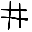
    


```python
image=load_img("../drissjd/Desktop/ApplicationSet/#.png",target_size=(32,32))
image=img_to_array(image) 
image=image/255.0
prediction_image=np.array(image)
prediction_image= np.expand_dims(image, axis=0)
```


```python
prediction=model.predict(prediction_image)
value=np.argmax(prediction)
move_name=mapper(value)
print("Prediction is {}.".format(move_name))
```

    Prediction is different than.


```python
load_img("../drissjd/Desktop/ApplicationSet/sigma.png",target_size=(32,32))
```


    
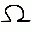
    


```python
image=load_img("../drissjd/Desktop/ApplicationSet/sigma.png",target_size=(32,32))
image=img_to_array(image) 
image=image/255.0
prediction_image=np.array(image)
prediction_image= np.expand_dims(image, axis=0)
```


```python
prediction=model.predict(prediction_image)
value=np.argmax(prediction)

move_name=mapper(value)
print("Prediction is {}.".format(move_name))
```

    Prediction is omega.


```python
load_img("../drissjd/Desktop/ApplicationSet/plus.png",target_size=(32,32))
```


    
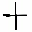
    


```python
image=load_img("../drissjd/Desktop/ApplicationSet/plus.png",target_size=(32,32))
image=img_to_array(image) 
image=image/255.0
prediction_image=np.array(image)
prediction_image= np.expand_dims(image, axis=0)
```


```python
prediction=model.predict(prediction_image)
value=np.argmax(prediction)
move_name=mapper(value)
print("Prediction is {}.".format(move_name))
```

    Prediction is addition.


```python
load_img("../drissjd/Desktop/ApplicationSet/R.png",target_size=(32,32))
```


    
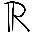
    


```python
image=load_img("../drissjd/Desktop/ApplicationSet/R.png",target_size=(32,32))
image=img_to_array(image) 
image=image/255.0
prediction_image=np.array(image)
prediction_image= np.expand_dims(image, axis=0)
```


```python
prediction=model.predict(prediction_image)
value=np.argmax(prediction)
move_name=mapper(value)
print("Prediction is {}.".format(move_name))
```

    Prediction is R numbers set.


```python
load_img("../drissjd/Desktop/ApplicationSet/=.png",target_size=(32,32))
```


    
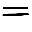
    


```python
image=load_img("../drissjd/Desktop/ApplicationSet/=.png",target_size=(32,32))
image=img_to_array(image) 
image=image/255.0
prediction_image=np.array(image)
prediction_image= np.expand_dims(image, axis=0)
```


```python
prediction=model.predict(prediction_image)
value=np.argmax(prediction)
move_name=mapper(value)
print("Prediction is {}.".format(move_name))
```

    Prediction is equal.


```python
load_img("../drissjd/Desktop/ApplicationSet/A.png",target_size=(32,32))
```


    
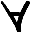
    


```python
image=load_img("../drissjd/Desktop/ApplicationSet/A.png",target_size=(32,32))
image=img_to_array(image) 
image=image/255.0
prediction_image=np.array(image)
prediction_image= np.expand_dims(image, axis=0)
```


```python
prediction=model.predict(prediction_image)
value=np.argmax(prediction)
move_name=mapper(value)
print("Prediction is {}.".format(move_name))
```

    Prediction is for all elements.


```python
load_img("../drissjd/Desktop/ApplicationSet/Z.png",target_size=(32,32))
```


    
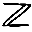
    


```python
image=load_img("../drissjd/Desktop/ApplicationSet/Z.png",target_size=(32,32))
image=img_to_array(image) 
image=image/255.0
prediction_image=np.array(image)
prediction_image= np.expand_dims(image, axis=0)
```


```python
prediction=model.predict(prediction_image)
value=np.argmax(prediction)
move_name=mapper(value)
print("Prediction is {}.".format(move_name))
```

    Prediction is Set of integers.


# The mu here is written with a long line on the left which is different than training and test sets so the training algorithm gives priority to the symbol that looks close enough 


```python
load_img("../drissjd/Desktop/ApplicationSet/mu.png",target_size=(32,32))
```


    

    


```python
image=load_img("../drissjd/Desktop/ApplicationSet/mu.png",target_size=(32,32))
image=img_to_array(image) 
image=image/255.0
prediction_image=np.array(image)
prediction_image= np.expand_dims(image, axis=0)
```


```python
prediction=model.predict(prediction_image)
value=np.argmax(prediction)
move_name=mapper(value)
print("Prediction is {}.".format(move_name))
```

    Prediction is left-bracket.


# when mu is written correctly


```python
load_img("../drissjd/Desktop/ApplicationSet/mu2.png",target_size=(32,32))
```


    
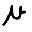
    


```python
image=load_img("../drissjd/Desktop/ApplicationSet/mu2.png",target_size=(32,32))
image=img_to_array(image) 
image=image/255.0
prediction_image=np.array(image)
prediction_image= np.expand_dims(image, axis=0)
```


```python
prediction=model.predict(prediction_image)
value=np.argmax(prediction)
move_name=mapper(value)
print("Prediction is {}.".format(move_name))
```

    Prediction is mu.


```python
load_img("../drissjd/Desktop/ApplicationSet/U.png",target_size=(32,32))
```


    
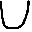
    


```python
image=load_img("../drissjd/Desktop/ApplicationSet/U.png",target_size=(32,32))
image=img_to_array(image) 
image=image/255.0
prediction_image=np.array(image)
prediction_image= np.expand_dims(image, axis=0)
```


```python
prediction=model.predict(prediction_image)
value=np.argmax(prediction)
move_name=mapper(value)
print("Prediction is {}.".format(move_name))
```

    Prediction is union.


# Mistakes the prediction algorithm does when the image is bigger much than 32x32 or close to another training set of images size and has the same courvatures 


```python
load_img("../drissjd/Desktop/ApplicationSet/{.png",target_size=(32,32))
```


    
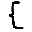
    


```python
image=load_img("../drissjd/Desktop/ApplicationSet/{.png",target_size=(32,32))
image=img_to_array(image) 
image=image/255.0
prediction_image=np.array(image)
prediction_image= np.expand_dims(image, axis=0)
```


```python
prediction=model.predict(prediction_image)
value=np.argmax(prediction)
move_name=mapper(value)
print("Prediction is {}.".format(move_name))
```

    Prediction is belongs to.


# when written proprely at the proper image size


```python
load_img("../drissjd/Desktop/ApplicationSet/{{.png",target_size=(32,32))
```


    
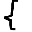
    


```python
image=load_img("../drissjd/Desktop/ApplicationSet/{{.png",target_size=(32,32))
image=img_to_array(image) 
image=image/255.0
prediction_image=np.array(image)
prediction_image= np.expand_dims(image, axis=0)
```


```python
prediction=model.predict(prediction_image)
value=np.argmax(prediction)
move_name=mapper(value)
print("Prediction is {}.".format(move_name))
```

    Prediction is left-bracket.


```python
load_img("../drissjd/Desktop/ApplicationSet/integral.png",target_size=(32,32))
```


    
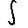
    


```python
image=load_img("../drissjd/Desktop/ApplicationSet/integral.png",target_size=(32,32))
image=img_to_array(image) 
image=image/255.0
prediction_image=np.array(image)
prediction_image= np.expand_dims(image, axis=0)
```


```python
prediction=model.predict(prediction_image)
value=np.argmax(prediction)
move_name=mapper(value)
print("Prediction is {}.".format(move_name))
```

    Prediction is integral.


```python
load_img("../drissjd/Desktop/ApplicationSet/inter.png",target_size=(32,32))
```


    
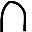
    


```python
image=load_img("../drissjd/Desktop/ApplicationSet/inter.png",target_size=(32,32))
image=img_to_array(image) 
image=image/255.0
prediction_image=np.array(image)
prediction_image= np.expand_dims(image, axis=0)
```


```python
prediction=model.predict(prediction_image)
value=np.argmax(prediction)
move_name=mapper(value)
print("Prediction is {}.".format(move_name))
```

    Prediction is intersection.


```python
load_img("../drissjd/Desktop/ApplicationSet/pi.png",target_size=(32,32))
```


    
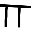
    


```python
image=load_img("../drissjd/Desktop/ApplicationSet/pi.png",target_size=(32,32))
image=img_to_array(image) 
image=image/255.0
prediction_image=np.array(image)
prediction_image= np.expand_dims(image, axis=0)
```


```python
prediction=model.predict(prediction_image)
value=np.argmax(prediction)
move_name=mapper(value)
print("Prediction is {}.".format(move_name))
```

    Prediction is pi.


```python
load_img("../drissjd/Desktop/ApplicationSet/alpha.png",target_size=(32,32))
```


    
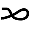
    


```python
image=load_img("../drissjd/Desktop/ApplicationSet/alpha.png",target_size=(32,32))
image=img_to_array(image) 
image=image/255.0
prediction_image=np.array(image)
prediction_image= np.expand_dims(image, axis=0)
```


```python
prediction=model.predict(prediction_image)
value=np.argmax(prediction)
move_name=mapper(value)
print("Prediction is {}.".format(move_name))
```

    Prediction is alpha.


```python
load_img("../drissjd/Desktop/ApplicationSet/almost=.png",target_size=(32,32))
```


    
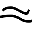
    


```python
image=load_img("../drissjd/Desktop/ApplicationSet/almost=.png",target_size=(32,32))
image=img_to_array(image) 
image=image/255.0
prediction_image=np.array(image)
prediction_image= np.expand_dims(image, axis=0)
```


```python
prediction=model.predict(prediction_image)
value=np.argmax(prediction)
move_name=mapper(value)
print("Prediction is {}.".format(move_name))
```

    Prediction is almost equal.


```python
load_img("../drissjd/Desktop/ApplicationSet/euro.png",target_size=(32,32))
```


    
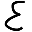
    


```python
image=load_img("../drissjd/Desktop/ApplicationSet/euro.png",target_size=(32,32))
image=img_to_array(image) 
image=image/255.0
prediction_image=np.array(image)
prediction_image= np.expand_dims(image, axis=0)
```


```python
prediction=model.predict(prediction_image)
value=np.argmax(prediction)
move_name=mapper(value)
print("Prediction is {}.".format(move_name))
```

    Prediction is belongs to.


```python
load_img("../drissjd/Desktop/ApplicationSet/%.png",target_size=(32,32))
```


    
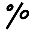
    


```python
image=load_img("../drissjd/Desktop/ApplicationSet/%.png",target_size=(32,32))
image=img_to_array(image) 
image=image/255.0
prediction_image=np.array(image)
prediction_image= np.expand_dims(image, axis=0)
```


```python
prediction=model.predict(prediction_image)
value=np.argmax(prediction)
move_name=mapper(value)
print("Prediction is {}.".format(move_name))
```

    Prediction is pourcentage.


```python
load_img("../drissjd/Desktop/ApplicationSet/negativeeuro.png",target_size=(32,32))
```


    
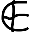
    


```python
image=load_img("../drissjd/Desktop/ApplicationSet/negativeeuro.png",target_size=(32,32))
image=img_to_array(image) 
image=image/255.0
prediction_image=np.array(image)
prediction_image= np.expand_dims(image, axis=0)
```


```python
prediction=model.predict(prediction_image)
value=np.argmax(prediction)
move_name=mapper(value)
print("Prediction is {}.".format(move_name))
```

    Prediction is does NOT belong to.


```python

```
