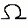
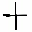
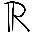
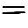
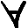
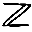
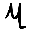

```python
import tensorflow as tf
import numpy as np
import pandas as pd
import os
import matplotlib.pyplot as plt

from tensorflow.keras.utils import to_categorical
from tensorflow.keras.preprocessing.image import load_img, img_to_array
from tensorflow.python.keras.preprocessing.image import ImageDataGenerator

from sklearn.metrics import classification_report, log_loss, accuracy_score
from sklearn.model_selection import train_test_split
```

AI Project Mathematical handwritten symbols prediction

Divide into training and test datasets


```python
directory = '../drissjd/Desktop/dataset'
```


```python
Name=[]
for file in os.listdir(directory):
    if file!='.directory' and file!='.DS_Store':
        Name+=[file]
print(Name)
print(len(Name))
```

    ['beta', 'does NOT belong to', 'for all elements', 'Set of integers', 'division', 'mu', 'mul', 'R numbers set', 'belongs to', 'pourcentage', 'right-bracket', 'left-bracket', 'almost equal', 'intersection', 'sigma', 'pi', 'substraction', 'equivalence', 'dec', 'equal', 'union', 'fi', 'omega', 'alpha', 'integral', 'different than', 'addition']
    27


```python
N=[]
for i in range(len(Name)):
    N+=[i]
    
normal_mapping=dict(zip(Name,N)) 
reverse_mapping=dict(zip(N,Name)) 

def mapper(value):
    return reverse_mapping[value]
```


```python
dataset=[]
testset=[]
count=0
for name in Name:
    path=os.path.join(directory,name)
    t=0
    for im in os.listdir(path):
        if im[-4:]=='.jpg':
            image=load_img(os.path.join(path,im), grayscale=False, color_mode='rgb', target_size=(32,32))
            image=img_to_array(image)
            image=image/255.0
            if t<255:
                dataset.append([image,count])
            else:   
                testset.append([image,count])
            t+=1
    print(t)
    count=count+1
```

    97
    134
    211
    102
    557
    110
    567
    175
    132
    89
    33
    120
    205
    105
    255
    153
    625
    120
    624
    630
    93
    134
    161
    108
    350
    106
    567


```python
data,labels0=zip(*dataset)
test,tlabels0=zip(*testset)
```


```python
labels1=to_categorical(labels0)
data=np.array(data)
labels=np.array(labels1)
```


```python
tlabels1=to_categorical(tlabels0)
test=np.array(test)
tlabels=np.array(tlabels1)
```


```python
trainx,testx,trainy,testy=train_test_split(data,labels,test_size=0.2,random_state=44)
```


```python
print(trainx.shape)
print(testx.shape)
print(trainy.shape)
print(testy.shape)
```

    (3542, 32, 32, 3)
    (886, 32, 32, 3)
    (3542, 27)
    (886, 27)


```python
datagen = ImageDataGenerator(horizontal_flip=True,vertical_flip=True,rotation_range=20,zoom_range=0.2,
                        width_shift_range=0.2,height_shift_range=0.2,shear_range=0.1,fill_mode="nearest")
```


```python
pretrained_model3 = tf.keras.applications.DenseNet201(input_shape=(32,32,3),include_top=False,weights='imagenet',pooling='avg')
pretrained_model3.trainable = False
```


```python
inputs3 = pretrained_model3.input
x3 = tf.keras.layers.Dense(128, activation='relu')(pretrained_model3.output)
outputs3 = tf.keras.layers.Dense(27, activation='softmax')(x3)
model = tf.keras.Model(inputs=inputs3, outputs=outputs3)
```


```python
model.compile(optimizer='adam',loss='categorical_crossentropy',metrics=['accuracy'])
```


```python
his=model.fit(datagen.flow(trainx,trainy,batch_size=32),validation_data=(testx,testy),epochs=10)
```

    Epoch 1/10
    111/111 [==============================] - 23s 149ms/step - loss: 1.5124 - accuracy: 0.5861 - val_loss: 0.8723 - val_accuracy: 0.7562
    Epoch 2/10
    111/111 [==============================] - 14s 130ms/step - loss: 0.8737 - accuracy: 0.7431 - val_loss: 0.5994 - val_accuracy: 0.8318
    Epoch 3/10
    111/111 [==============================] - 14s 130ms/step - loss: 0.6946 - accuracy: 0.7931 - val_loss: 0.5888 - val_accuracy: 0.8228
    Epoch 4/10
    111/111 [==============================] - 15s 132ms/step - loss: 0.6471 - accuracy: 0.7990 - val_loss: 0.5007 - val_accuracy: 0.8510
    Epoch 5/10
    111/111 [==============================] - 15s 135ms/step - loss: 0.6036 - accuracy: 0.8114 - val_loss: 0.5376 - val_accuracy: 0.8115
    Epoch 6/10
    111/111 [==============================] - 16s 142ms/step - loss: 0.5638 - accuracy: 0.8252 - val_loss: 0.4217 - val_accuracy: 0.8736
    Epoch 7/10
    111/111 [==============================] - 16s 140ms/step - loss: 0.5084 - accuracy: 0.8430 - val_loss: 0.4580 - val_accuracy: 0.8713
    Epoch 8/10
    111/111 [==============================] - 15s 138ms/step - loss: 0.4913 - accuracy: 0.8405 - val_loss: 0.4000 - val_accuracy: 0.8702
    Epoch 9/10
    111/111 [==============================] - 15s 135ms/step - loss: 0.4779 - accuracy: 0.8450 - val_loss: 0.3952 - val_accuracy: 0.8657
    Epoch 10/10
    111/111 [==============================] - 15s 135ms/step - loss: 0.4861 - accuracy: 0.8329 - val_loss: 0.3954 - val_accuracy: 0.8702


```python
y_pred=model.predict(testx)
pred=np.argmax(y_pred,axis=1)
ground = np.argmax(testy,axis=1)
print(classification_report(ground,pred))
```

                  precision    recall  f1-score   support
    
               0       0.54      0.47      0.50        15
               1       0.77      0.93      0.84        29
               2       0.84      1.00      0.91        32
               3       0.72      0.72      0.72        18
               4       0.97      0.84      0.90        45
               5       0.95      0.76      0.84        25
               6       0.94      0.98      0.96        59
               7       1.00      0.87      0.93        39
               8       0.81      0.91      0.85        32
               9       1.00      0.91      0.95        22
              10       0.00      0.00      0.00         8
              11       0.74      0.88      0.81        26
              12       0.98      0.91      0.94        46
              13       0.00      0.00      0.00        18
              14       0.78      0.90      0.83        39
              15       0.89      0.93      0.91        27
              16       0.94      1.00      0.97        49
              17       0.94      0.94      0.94        35
              18       1.00      1.00      1.00        51
              19       0.98      0.91      0.94        53
              20       0.40      0.57      0.47        21
              21       0.83      0.86      0.84        22
              22       0.86      0.91      0.89        34
              23       0.74      0.70      0.72        20
              24       0.95      0.87      0.91        45
              25       1.00      0.88      0.94        26
              26       0.89      1.00      0.94        50
    
        accuracy                           0.87       886
       macro avg       0.79      0.80      0.80       886
    weighted avg       0.86      0.87      0.86       886
    


```python
load_img("../drissjd/Desktop/dataset/mul/1435.jpg",target_size=(32,32))
```


    

    


```python
image=load_img("../drissjd/Desktop/dataset/mul/1435.jpg",target_size=(32,32))
image=img_to_array(image) 
image=image/255.0
prediction_image=np.array(image)
prediction_image= np.expand_dims(image, axis=0)
```


```python
prediction=model.predict(prediction_image)
value=np.argmax(prediction)
move_name=mapper(value)
print("Prediction is {}.".format(move_name))
```

    Prediction is mul.


```python
load_img("../drissjd/Desktop/ApplicationSet/sigma.png",target_size=(32,32))
```


    

    


```python
image=load_img("../drissjd/Desktop/ApplicationSet/sigma.png",target_size=(32,32))
image=img_to_array(image) 
image=image/255.0
prediction_image=np.array(image)
prediction_image= np.expand_dims(image, axis=0)
```


```python
prediction=model.predict(prediction_image)
value=np.argmax(prediction)
move_name=mapper(value)
print("Prediction is {}.".format(move_name))
```

    Prediction is omega.


```python
load_img("../drissjd/Desktop/ApplicationSet/plus.png",target_size=(32,32))
```


    

    


```python
image=load_img("../drissjd/Desktop/ApplicationSet/plus.png",target_size=(32,32))
image=img_to_array(image) 
image=image/255.0
prediction_image=np.array(image)
prediction_image= np.expand_dims(image, axis=0)
```


```python
prediction=model.predict(prediction_image)
value=np.argmax(prediction)
move_name=mapper(value)
print("Prediction is {}.".format(move_name))
```

    Prediction is addition.


```python
load_img("../drissjd/Desktop/ApplicationSet/R.png",target_size=(32,32))
```


    

    


```python
image=load_img("../drissjd/Desktop/ApplicationSet/R.png",target_size=(32,32))
image=img_to_array(image) 
image=image/255.0
prediction_image=np.array(image)
prediction_image= np.expand_dims(image, axis=0)
```


```python
prediction=model.predict(prediction_image)
value=np.argmax(prediction)
move_name=mapper(value)
print("Prediction is {}.".format(move_name))
```

    Prediction is R numbers set.


```python
load_img("../drissjd/Desktop/ApplicationSet/=.png",target_size=(32,32))
```


    

    


```python
image=load_img("../drissjd/Desktop/ApplicationSet/=.png",target_size=(32,32))
image=img_to_array(image) 
image=image/255.0
prediction_image=np.array(image)
prediction_image= np.expand_dims(image, axis=0)
```


```python
prediction=model.predict(prediction_image)
value=np.argmax(prediction)
move_name=mapper(value)
print("Prediction is {}.".format(move_name))
```

    Prediction is equal.


```python
load_img("../drissjd/Desktop/ApplicationSet/A.png",target_size=(32,32))
```


    

    


```python
image=load_img("../drissjd/Desktop/ApplicationSet/A.png",target_size=(32,32))
image=img_to_array(image) 
image=image/255.0
prediction_image=np.array(image)
prediction_image= np.expand_dims(image, axis=0)
```


```python
prediction=model.predict(prediction_image)
value=np.argmax(prediction)
move_name=mapper(value)
print("Prediction is {}.".format(move_name))
```

    Prediction is for all elements.


```python
load_img("../drissjd/Desktop/ApplicationSet/Z.png",target_size=(32,32))
```


    

    


```python
image=load_img("../drissjd/Desktop/ApplicationSet/Z.png",target_size=(32,32))
image=img_to_array(image) 
image=image/255.0
prediction_image=np.array(image)
prediction_image= np.expand_dims(image, axis=0)
```


```python
prediction=model.predict(prediction_image)
value=np.argmax(prediction)
move_name=mapper(value)
print("Prediction is {}.".format(move_name))
```

    Prediction is Set of integers.


```python
load_img("../drissjd/Desktop/ApplicationSet/mu.png",target_size=(32,32))
```


    

    


```python
image=load_img("../drissjd/Desktop/ApplicationSet/mu.png",target_size=(32,32))
image=img_to_array(image) 
image=image/255.0
prediction_image=np.array(image)
prediction_image= np.expand_dims(image, axis=0)
```


```python
prediction=model.predict(prediction_image)
value=np.argmax(prediction)
move_name=mapper(value)
print("Prediction is {}.".format(move_name))
```

    Prediction is mu.


```python
load_img("../drissjd/Desktop/ApplicationSet/U.png",target_size=(32,32))
```


    

    


```python
image=load_img("../drissjd/Desktop/ApplicationSet/U.png",target_size=(32,32))
image=img_to_array(image) 
image=image/255.0
prediction_image=np.array(image)
prediction_image= np.expand_dims(image, axis=0)
```


```python
prediction=model.predict(prediction_image)
value=np.argmax(prediction)
move_name=mapper(value)
print("Prediction is {}.".format(move_name))
```

    Prediction is union.


```python

```
